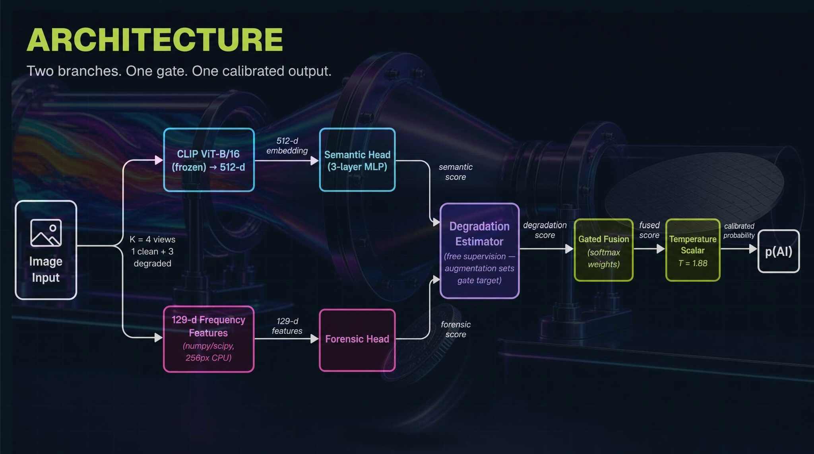
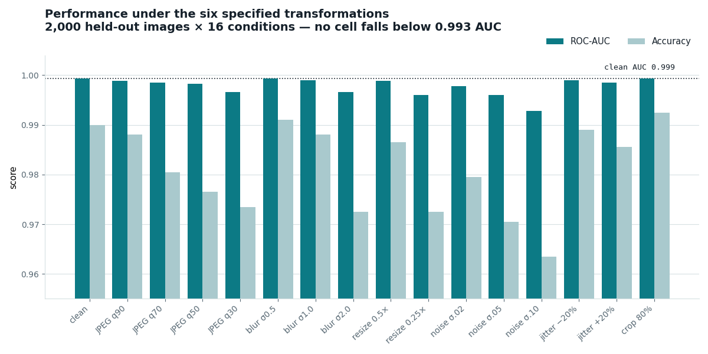

# Robust Detection of AI-Generated Images Under Real-World Transformations


A binary real-vs-AI-generated image detector built so its accuracy survives the
JPEG re-encoding, resizing and blur every image picks up on its way through a
social platform. Two evidence branches, a gate that decides how much to trust
each, and a training objective that rewards a *consistent* answer rather than
just a correct one.



### Where each deliverable lives

| # | Deliverable | Location |
|---|---|---|
| 1 | Written project description | §1 below |
| 2 | Public repo — commented code, all components | this repository |
| 2 | Graded script: image dir → JSON of `{image_path, pred}` | [`predict.py`](predict.py) |
| 2 | README: overview / setup / reproduce / limitations / contributions | §1–§5 below |
| 3 | Demo video (YouTube, linked on Devpost) | https://youtu.be/l08VUBulW9M |
| 4 | Robustness evaluation summary (clean vs transformed) | [`results/robustness_table.md`](results/robustness_table.md) · §3 |
| 5 | Error analysis note (representative FP / FN, trade-offs) | [`results/error_analysis.md`](results/error_analysis.md) |

The graded script in one line:

```bash
python predict.py --image-dir path/to/images --out predictions.json
```

**Try it without installing anything:**
[open the Colab notebook](https://colab.research.google.com/github/mxhxmza/ai_img_detector/blob/main/notebooks/aigc_detector_colab.ipynb)
— `Runtime → Run all`, upload images in section 4. Name them `real_*` / `ai_*`
and it prints accuracy, precision, recall, F1, ROC-AUC and a confusion matrix
for the batch.

---

## 1. Project Overview

### The problem
Detectors that score well on pristine images collapse on real ones. The most
discriminative generative fingerprints — periodic upsampling artifacts in the
Fourier spectrum, absent sensor noise, over-smooth micro-texture — live in the
high-frequency band that JPEG re-encoding, blur and downscaling attenuate
first. A social platform's redistribution pipeline is, incidentally, an almost
optimal attack on frequency-domain forensics. Every image a moderation system
sees has already been through it.

### The approach
Two branches with a **degradation-aware gate**:

```
   frozen CLIP embedding ────────► semantic head ──┐
                                                    ├─► gated fusion ─► calibrated p(AI)
   hand-designed frequency ──────► forensic head ──┘
   features            │                    ▲
                       └─► degradation estimator ───┘
                           (predicts how damaged the image is)
```

The forensic branch is precise on clean images and fragile under compression.
The semantic branch is coarser but survives. Rather than mixing them with
fixed weights, a small head **estimates how degraded the image is** and that
estimate sets the fusion weights — so the model can lean on frequency evidence
for a pristine PNG and on semantics for a q30 re-encode, without being told
which it is at test time.

The degradation estimator trains on free supervision: we applied the
degradations, so we know the answer.

Training adds a **consistency loss** between the clean and degraded views of
the same image. Plain augmentation says "also classify the damaged version
correctly". Consistency says "give it the *same* answer as the clean one",
which is strictly stronger and is the property the robustness table measures.

### The task
A binary classifier: **real vs fully AI-generated**. The data (SID_Set) also
contains *tampered* images — real photographs with an AI-edited region. A
tampered image was still taken by a person, so it is treated as real; only
fully synthetic images are flagged.

### Relationship to prior work
This builds on, rather than reproduces, two known families: CLIP-feature
detectors and frequency-artifact detectors. The intended contribution is the
degradation-conditioned gating between them plus the consistency objective.
Neither branch alone is novel and we do not claim it is.

**Honest note on the ablation** ([`results/ablation_table.md`](results/ablation_table.md)):
on this corpus the frequency branch, the gate, and the consistency loss are a
wash — the frozen CLIP head alone matches the full model within ±0.001 AUC on
both the held-out set and the transfer benchmark. After the external DALL·E 3
pass the training data became largely semantically separable, and CLIP is
already robust to the six transforms, so the forensic fallback never binds.
The full architecture is shipped anyway (it costs ≈564k params and never
regresses anything) and is the right structure for a harder distribution, but
the numbers below are carried by the semantic branch.

---

## 2. Setup

**Blackwell / RTX 50-series users read this first.** These GPUs are compute
capability `sm_120`. A PyTorch wheel built against older CUDA will report
`cuda.is_available() == True`, load models fine, and then fail on the first
real forward pass. Install from the CUDA 12.8 index:

```bash
python -m venv .venv && source .venv/bin/activate   # Windows: .venv\Scripts\activate
pip install torch torchvision --index-url https://download.pytorch.org/whl/cu128
pip install -r requirements.txt

python scripts/verify_env.py     # must print PASS before you go further
```

`verify_env.py` runs an actual fp16 matmul rather than just allocating a
tensor, because allocation succeeds on builds that cannot execute kernels.

---

## 3. Steps to Reproduce

The whole pipeline is one linear sequence. There is **one dataset** and **one
model** — no per-source variants.

### 3.0 Smoke test (optional, ~3 min, no download)

Verify the plumbing end-to-end on generated data before fetching anything.
The synthetic "real" class carries 1/f falloff plus a sensor-noise floor; the
"fake" class is built small and bicubically upsampled, planting the periodic
artifact the forensic branch looks for.

```bash
python scripts/make_smoke_data.py --out data/smoke_raw
python scripts/build_dataset.py --raw data/smoke_raw --out data/smoke \
    --manifest data/smoke/manifest.csv
python -m src.features.extract --manifest data/smoke/manifest.csv \
    --out features_smoke/ --views 4 --backbone ViT-B-16 --batch-size 64
python -m src.train --features features_smoke/ --out checkpoints_smoke/ \
    --epochs 8 --batch-size 32 --tag full
```

The smoke set is separable by construction, so it reports AUC ≈ 1.0. That
number means "the pipeline is wired correctly", **not** "the model works" —
never quote it.

### 3.1 The real run

[SID_Set](https://huggingface.co/datasets/saberzl/SID_Set) (CC-BY-4.0) is
~300k full-resolution images: real photos from OpenImages V7, fully-synthetic
images, and tampered images. It is 140 GB, so `fetch_sid_set.py` streams a
balanced subset (no full download), re-saving everything as PNG at ≤512 px.

```bash
pip install datasets

# 1. Download a balanced subset (~10 GB at 10k/class). Resumable, and
#    re-runnable with a larger --per-class to top the subset up later.
python scripts/fetch_sid_set.py --out data/sid_set --per-class 10000 --include-tampered

# 2. Split and organise into data/train/{real,ai} and data/test/{real,ai},
#    and write data/manifest.csv. The train/test boundary is a physical
#    folder split, so "never trained on test" is structural, not a promise.
#    Additive: re-running after a top-up keeps every existing split assignment.
python scripts/build_dataset.py

# 3. Extract cached features. One-time cost (~25 min); every run after is seconds.
#    --workers 2 on Windows: the forensic worker pool can deadlock at 4.
python -m src.features.extract --manifest data/manifest.csv --out features/ \
    --views 4 --backbone ViT-B-16 --batch-size 128 --workers 2

# 4. Train. Run just `full` for the shipped model, or all four for the
#    ablation table (results/ablation_table.md):
python -m src.train --features features/ --tag baseline --no-forensic --no-gate --no-consistency
python -m src.train --features features/ --tag aug      --no-forensic --no-gate
python -m src.train --features features/ --tag freq     --no-gate
python -m src.train --features features/ --tag full

# 5. Robustness evaluation -> results/robustness_table.md
python -m src.evaluate --manifest data/manifest.csv \
    --checkpoint checkpoints/full.pt --split test --out results/

# 6. Error analysis -> results/error_analysis.md
python -m src.error_analysis --manifest data/manifest.csv \
    --checkpoint checkpoints/full.pt --split test --out results/

# 7. Inference (the graded CLI)
python predict.py --image-dir path/to/images --out predictions.json
```

### Hard-negative pass (optional, but it is in the shipped checkpoint)

The detector's residual errors were all one shape: a *polished* real photograph
— travel framing, shallow depth of field, saturated colour, foreground bokeh —
read as synthetic, because SID_Set's reals skew more casual than its synthetics.
`add_hard_negatives.py` attacks exactly that, and nothing else: it mines the
training reals the current checkpoint scores highest as AI, augments them (and
any real photo you supply) into many crops, and appends them as `kind=hard_real`.
Purely additive — no existing image or manifest row is touched — so the model
keeps everything it already learned.

```bash
python scripts/add_hard_negatives.py --checkpoint checkpoints/full.pt --extra data/check
python -m src.features.extract --manifest data/manifest.csv --out features/ \
    --views 4 --backbone ViT-B-16 --batch-size 128 --workers 2
python -m src.train --features features/ --out checkpoints/ --epochs 30 --tag full
```

Measured effect on the *unchanged* held-out set: false positives 13 → **7**
(1.2% → 0.4% of genuine photos), accuracy 0.994 → **0.996**, F1 0.991 →
**0.993**, AI recall still 99.6%. A held-out slice of the augmented crops went
from mean p(AI) 0.22 (5 flagged) to **0.015 (0 flagged)**, so it generalised
rather than memorised.

### SID top-up (also in the shipped checkpoint)

The subset was then extended from ~6.2k to **10k images per class** (18,748 →
30,180 rows) — same three SID kinds, `build_dataset.py` run again. It is
additive by construction: every image that already had a train/test split
keeps it, so no picture the previous checkpoint was evaluated on moved into
training. More diffusion variety, no new generator families.

Measured on the *pre-top-up* held-out set (2,255 images, unseen by both
checkpoints): accuracy 0.9956 → **0.9965**, F1 0.9933 → **0.9947**, AI recall
0.996 → **1.000** (3 false negatives → 0), one extra false positive (7 → 8).
In-distribution the model was already near the ceiling; the real movement is
on the WildFake transfer benchmark below — `laion_matched` AUC 0.910 →
**0.930**, and an unseen GAN (GigaGAN) 0.500 → **0.581** with no GAN in
training.

### External DALL·E 3 / GAN pass (also in the shipped checkpoint)

SID_Set is diffusion-only and contains no DALL·E 3 and no GANs, and the
WildFake benchmark showed both as weak spots. This pass adds, from sources
that are **not** WildFake and perceptual-hash-checked against every image in
the eval set:

| kind | n | source |
|---|---|---|
| `ext_dalle3` | 2,681 | DALL·E 3, reddit scrapes (~1024px) |
| `ext_progan` | 3,380 | ProGAN, ForenSynths (256px) |
| `lsun` | 3,327 real | LSUN photos, same 256px pipeline — resolution partner |
| `real_square` | 2,652 real | square-cropped SID reals — aspect-ratio partner |

(SID synthetics are 100% square and its reals 94% non-square, so "square"
already predicts "AI"; the partner buckets keep resolution and aspect ratio
uninformative.)

```bash
python scripts/fetch_external_ai.py --per-bucket 3000    # leak-checks vs WildFake
python scripts/add_external_ai.py                        # additive merge
python -m src.features.extract --manifest data/manifest.csv --out features/ \
    --views 4 --backbone ViT-B-16 --batch-size 128 --workers 2
python -m src.train --features features/ --out checkpoints/ --epochs 30 --tag full
```

**The DALL·E half worked; the ProGAN half did not.** On WildFake:

| | before | after |
|---|---|---|
| `laion_matched` AUC | 0.930 | **0.989** |
| `default` / `normalized` AUC | 0.959 / 0.947 | **0.999 / 0.997** |
| DALL·E 3 recall @0.5 | 0.72 | **0.93** |
| Midjourney v5 recall @0.5 | 0.69 | **0.87** (transferred from DALL·E) |
| GigaGAN recall @0.5 | 0.04 | 0.04 (ProGAN did not transfer) |
| `cross_generator` AUC | 0.826 | 0.808 |
| false positives, LAION reals | 1.7% | **6.0%** |

Two DALL·E-3 and GigaGAN images that this model originally scored as *real*
turned out to be byte-identical to WildFake eval images, so they could not go
into training. They serve as an unbiased spot check: after the pass the DALL·E
image went **0.20 → 1.00** (caught by generalisation, never seen), the GigaGAN
image stayed missed at **0.002**.

The cost is real: false positives on LAION-style real photos rose 1.7% → 6.0%
(plain COCO photos stay under 1%), in-distribution accuracy slipped
0.9964 → 0.9929, and per-family robustness 0.9998 → 0.998. The trade was taken
deliberately — DALL·E 3 and Midjourney are the generators a user is most
likely to meet.

### The shipped checkpoint

`checkpoints/full.pt` (2.2 MB) is the SID_Set base plus all three additive
passes above. Every pass keeps every existing train/test split, so the
held-out numbers below were never trained on at any stage.

| stage | train images | WildFake `laion_matched` AUC |
|---|---|---|
| SID base + hard negatives | 18,748 | 0.910 |
| + SID top-up to 10k/class | 30,180 | 0.930 |
| + external DALL·E 3 / GAN | **42,220** | **0.989** |

In-distribution F1 held at ≈0.99 across all three stages — the passes bought
transfer, not headline accuracy (and the last one cost a little of it).

### Reference numbers

SID_Set (10k/class) + hard-negative + external DALL·E 3/GAN pass — **42,220
images**, 5,072 held out in `data/test/`, ViT-B-16, RTX 5060, seed 0. Scored
on the full held-out set:

| metric | value |
|---|---|
| Accuracy | **0.993** |
| Precision | **0.990** |
| Recall | **0.992** |
| F1 | **0.991** |
| ROC-AUC | **1.000** |

**20** false positives (0.64% of real), **16** false negatives (0.83% of AI).
By kind: genuine photos 11/1200, tampered 4/1200, ProGAN 7/406, LSUN 5/399,
DALL·E 3 6/322. `results/error_analysis.md` has the full breakdown; the 27
held-out hard-negative crops score 0 errors.



**Robustness** (2,000-image balanced subsample × 16 transform cells): clean
AUC **0.999**, no cell below **0.993** — JPEG down to q30, blur to σ=2.0,
downscale to 0.25×, noise to σ=0.1, ±20% colour jitter, 80% crop. Mean AUC
drop **+0.0017**, worst-case accuracy 0.964, ECE ≤ 0.026. Per-family final
score **0.998** (down from 0.9998 before the external pass — the broader AI
class costs a little consistency). Full grid in `results/robustness_table.md`.

### WildFake reference benchmark (never trained on)

The numbers above are in-distribution. The track's demonstration subset
(`techjam-aigc/wildfake-eval-subset`) is a different corpus entirely — COCO
and LAION reals against DALL·E 3, Midjourney v5, SDXL and GigaGAN — so it
measures transfer, and it is the more honest read of what this model does in
the wild. `python scripts/eval_wildfake.py` reproduces it; nothing from it
ever enters `data/manifest.csv`.

| config | n | AUC | balanced acc @0.5 | @best threshold |
|---|---|---|---|---|
| `default` (spec-faithful) | 13,841 | 0.999 | 0.976 | 0.981 |
| `normalized` | 13,841 | 0.997 | 0.965 | 0.974 |
| **`laion_matched`** | 7,652 | **0.989** | 0.948 | 0.950 |
| `cross_generator` | 5,494 | 0.808 | 0.764 | 0.772 |

**Quote `laion_matched`, not `default`.** In `default` every COCO real is
exactly 200×200 and no DALL·E fake is, so `img.size == (200, 200)` scores
AUC **1.000** with no model at all. The eval script measures that shortcut
next to our score so the two can never be confused.

Two things this benchmark makes plain that the in-distribution numbers hide:

1. **Diffusion is well covered; modern GANs are not.** Per generator: DALL·E 3
   **0.99** / recall 0.93, Midjourney v5 **0.97** / 0.87, SDXL **0.82** /
   0.48, GigaGAN **0.45** / 0.04. The external pass added DALL·E 3 and ProGAN
   images: DALL·E detection jumped and carried Midjourney with it, but ProGAN
   did **not** transfer to GigaGAN — a 2018 category GAN and a 2023
   text-to-image GAN leave different traces. GigaGAN remains the clearest
   hole.
2. **DALL·E coverage was bought with real-photo false positives.** On
   `laion_matched` the false-positive rate on genuine LAION photos is ~6%
   (COCO stays under 1%). LAION web imagery sits close to the DALL·E
   aesthetic, and the model now leans on that aesthetic. A deployment that
   cares about not accusing real photographers should raise the threshold
   (`@best` recovers most of the balanced accuracy) or re-fit temperature on
   its own traffic.

Full tables, per-generator and per-source, in `results/wildfake_benchmark.md`;
raw per-image scores in `results/wildfake_scores.npz`.

### 3.2 Web interface

`app.py` is a local single-page app: drag in an image, get the calibrated
probability with a verdict and a slider between "authentic" and
"AI-generated". It is a thin front-end over the exact same forward pass as
`predict.py` (both go through `src/inference.py::Scorer`), runs entirely on
your machine, and never writes uploads to disk.

```bash
pip install fastapi uvicorn python-multipart
python app.py                                  # then open http://127.0.0.1:8000
```

`--host 0.0.0.0` exposes it on the LAN; `--port`, `--device`, `--checkpoint`
work as expected. `GET /api/info` reports the loaded checkpoint and `POST
/api/predict` (multipart field `image`) returns the JSON score, so the server
doubles as a scoring API.

### The graded script and its output format

The brief asks for:

> *A script that takes an image directory as input and outputs a confidence
> score for each image, indicating the likelihood that it is AIGC-generated.
> The output should be a JSON file containing `image_path` and `pred` for each
> image.*

That is [`predict.py`](predict.py), verbatim:

```bash
python predict.py --image-dir path/to/images --out predictions.json
```

```json
[
  {"image_path": "images/a.jpg", "pred": 0.9312},
  {"image_path": "images/b.png", "pred": 0.0417}
]
```

`pred` is a **calibrated probability in [0, 1]** that the image is
AI-generated. The brief says "confidence score ... indicating the likelihood",
which reads as a probability rather than a hard label, so that is the default;
`--format dict` and `--binary` cover the alternate readings without a code
change. Unreadable and non-image files are skipped and reported rather than
crashing the run — one corrupt file must never take down an evaluation.

Section 5 of the [Colab notebook](notebooks/aigc_detector_colab.ipynb) runs
this exact command on images you upload and prints the JSON it produces, if
you would rather see it than install anything.

### Design decisions that affect the numbers

- **Physical train/test folders.** `build_dataset.py` moves each image into
  `data/train/` or `data/test/`. An image is in exactly one folder, so
  training on a test image is impossible by construction — no hash-based
  leakage check to trust or disable.
- **Model selection on the balanced objective** (clean + transformed AUC),
  not clean AUC. Selecting on clean accuracy is the failure mode this whole
  project is about.
- **Temperature scaling** fitted on the held-out split after selection. It
  cannot change ranking, so AUC is unaffected; it only makes the confidence
  mean something.

### Compliance

| Rule | Status |
|---|---|
| <2B parameters (C-1) | ViT-B/16: 86,756,364 total (563,724 trainable + 86,192,640 frozen backbone), 23.1× headroom; ViT-L/14 ≈ 0.32B. Printed at load by `count_parameters`. |
| Public backbones only (C-2) | OpenAI CLIP via `open_clip`; no custom or private weights. |
| Public/licensed data only (C-3) | SID_Set, CC-BY-4.0. |
| No test-label training (C-4) | Structural: train/ and test/ are separate directories. |
| Augmentation scripts committed (C-5) | `src/transforms/degradations.py` + seeded sampler. |
| Open-source (C-6) | MIT, see LICENSE. |

Measured on a consumer RTX 5060 Laptop (8GB, sm_120), ViT-B-16: feature
extraction ~75 img·view/s, inference through `predict.py` ~30 img/s
end-to-end (CLIP + forensic features + head), training ~4 s/epoch on cached
pairs. `--backbone ViT-L-14` is one flag away and still under the cap.

---

## 4. Limitations and What I'd Improve With More Time

### Four active blind spots

These are the failure modes we can name, reproduce and measure. Each is a live
gap in the shipped checkpoint, not a hypothetical.

**1 — Hyperrealistic real photographs trigger false alarms.**
Studio-lit product shots, polished travel photography, and photographs *of*
artwork get flagged as synthetic. The model over-indexes on the ultra-clean,
low-noise look that high-end AI art shares with professional photography. On
the WildFake `laion_matched` config the false-alarm rate on genuine photos is
**6.0%** — it was 1.7% before the DALL·E 3 pass, and plain COCO snapshots stay
under 1%. Calling a real photograph synthetic is an accusation against a
person, so this is the limitation that most constrains deployment: the right
home for this model is a human-review queue, not automated enforcement.

**2 — Heavy noise works as a shield.**
Intense compression or additive noise buries the high-frequency fingerprint
the forensic branch depends on, and a degraded synthetic image starts to look
like a messy real snapshot. σ=0.1 noise is the worst cell in the grid: recall
at a 1%-false-positive operating point falls **99.7% → 89.6%**, accuracy
0.990 → 0.964, calibration error 0.008 → 0.026. Cell AUC still holds at 0.993,
so the *ranking* survives — but roughly one AI image in ten slips past a strict
threshold once it is noisy enough. An adversary who simply adds grain is not
being clever, and it partly works.

**3 — GigaGAN slips through.**
Modern text-to-image GANs are the clearest hole. DALL·E 3 (0.99 AUC, 93%
recall) and Midjourney v5 (0.97 AUC, 87%) are caught reliably; **GigaGAN sits
at 0.45 AUC and a 4% detection rate**. We added ProGAN to training and it did
*not* transfer — a 2018 category GAN and a 2023 text-to-image GAN leave
different traces. The fix is GigaGAN-class or StyleGAN-3 data in training, not
a different architecture.

**4 — Localised edits are invisible.**
A real photograph with a small AI-edited region scores as ~100% real. This is
partly by design: a tampered photo was still taken by a person, and "is this a
real photograph?" is the question we chose to answer. But it means partial
manipulation is out of scope entirely — only whole-image generation is
detected. Inpainting, face swaps and object removal all pass. A deployment
that cares about those needs a localisation model beside this one.

### Engineering and scope limitations

5. **Frozen backbone.** The semantic branch never adapts to the detection
   task — a deliberate trade for iteration speed on a single 8GB GPU.
   Fine-tuning the top blocks would likely help.
6. **Finite augmentation views.** Training uses K=4 fixed views per image
   rather than fresh random augmentation each epoch, a consequence of caching
   features. Larger K trades disk for diversity.
7. **Confidence does not survive a distribution shift.** Expected calibration
   error is 0.008 on clean held-out images and ≤0.026 across every transform
   cell, but reaches **0.301** on the `cross_generator` config — the one
   dominated by the generator family we barely detect. Calibration is not a
   separate problem from coverage; it is a symptom of it, and a useful early
   warning that the model is out of its depth. Re-fit temperature on
   deployment traffic.
8. **Incidental degradation, not adversarial.** The six transforms model a
   redistribution pipeline, not an adversary deliberately evading detection.
   Blind spot 2 above is the closest we come, and it was not designed as an
   attack.

**With more time** — in the order we would actually do them

- **Close blind spot 3:** add GigaGAN-class and StyleGAN-3 images to training,
  each paired with resolution- and aspect-matched real controls, and re-run
  the full before/after.
- **Close blind spot 1:** hard-negative mining specifically on studio, product
  and stock photography — the same targeted pass that took false positives
  from 1.2% to 0.4% earlier in the project.
- **Attack blind spot 2 directly:** train against noise-injected synthetics
  rather than only incidental degradation, and measure whether the gate learns
  to distrust the forensic branch harder at high σ.
- **Per-domain calibration** instead of one global temperature scalar.
- **An abstain option:** extend the gate to emit a reliability estimate so the
  system can decline on images too degraded to judge, rather than guessing.
- Unfreeze the last transformer blocks and compare.
- Add a provenance signal (C2PA) as a third branch where present.

---

## 5. Team Member Contributions

**Team submission.** All work — data pipeline, model, evaluation harness,
error analysis, and write-up — by the team listed on Devpost.

---

## Repository Layout

```
README.md                       this file (deliverable map + §1-§5)
DEVPOST.md                      draft written project description (deliverable 1)
predict.py                      graded inference CLI  (-> predictions.json)
app.py                          local web interface (upload -> probability)
requirements.txt                dependency pins (read the header first)
configs/default.yaml            committed hyperparameters
checkpoints/full.pt             the shipped model, 2.2 MB (committed)

assets/
  thumbnail.png                 3:2 Devpost gallery thumbnail
  architecture.png              the two-branch diagram above
  robustness_chart.png          clean vs 16 transform cells, charted

results/
  robustness_table.md           clean vs 16 transform cells (deliverable 4)
  error_analysis.md              representative FP / FN + trade-offs (deliverable 5)
  ablation_table.md              what each architecture piece contributes
  wildfake_benchmark.md          transfer benchmark, never trained on
  fp_grid.png / fn_grid.png      the error images the note refers to
  *_raw.json / *_scores.npz      raw numbers behind each table

notebooks/aigc_detector_colab.ipynb   Colab: clone, run on CPU, score + evaluate uploads

scripts/verify_env.py           sm_120 / CUDA check -- run first
scripts/fetch_sid_set.py        stream a balanced SID_Set subset to disk
scripts/build_dataset.py        split + organise -> data/{train,test} + manifest.csv
scripts/add_hard_negatives.py   mine + augment hard real photos into the train set
scripts/fetch_external_ai.py    pull DALL-E 3 / GAN images (non-WildFake, leak-checked)
scripts/add_external_ai.py      additively merge the external-AI images
scripts/eval_wildfake.py        WildFake reference benchmark (eval only)
scripts/make_smoke_data.py      tiny synthetic dataset for the plumbing test

src/data/manifest.py            the manifest: image_path, label, kind, split
src/transforms/degradations.py  the six specified transforms
src/features/frequency.py       hand-designed forensic features
src/features/extract.py         one-time cached feature extraction
src/models/detector.py          two-branch model + degradation gate + loss
src/models/calibration.py       temperature scaling
src/train.py                    training + ablation switches
src/evaluate.py                 robustness table
src/error_analysis.py           false-positive / false-negative analysis
src/inference.py                the single shared forward pass (Scorer)
src/metrics.py                  AUC, ECE, TPR@FPR, final-score formula
```

`data/` and `features/` are rebuilt by the scripts and are `.gitignore`d;
`checkpoints/full.pt` and everything in `results/` are committed.
