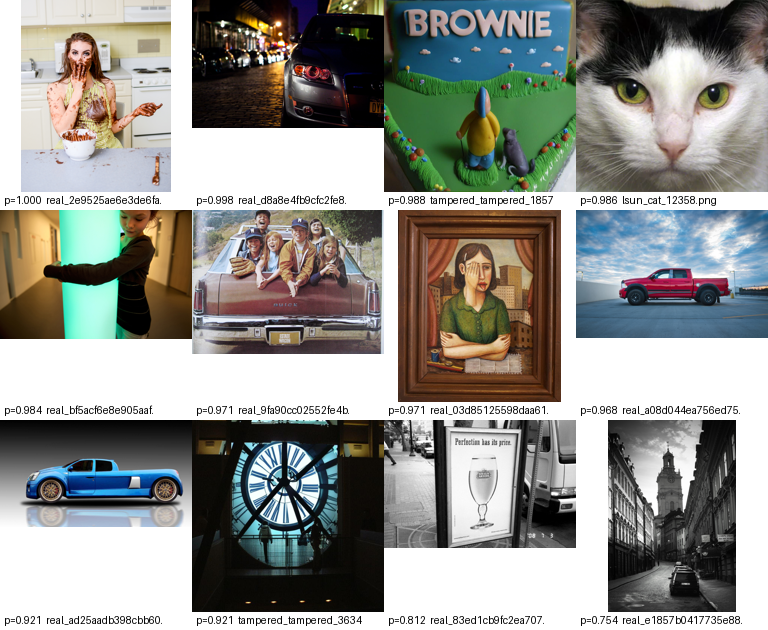
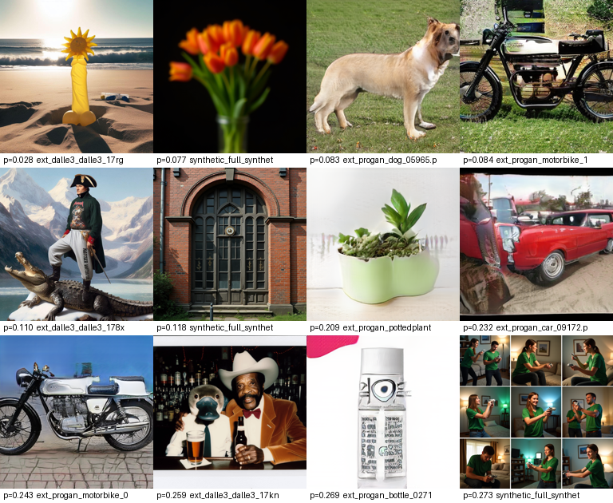

# Error Analysis Note

Split `test` | 5072 images | threshold 0.5

- False positives (real called AI): **20** (0.6% of real images)
- False negatives (AI called real): **16** (0.8% of AI images)

## Error rate by image kind

| Kind | total | false pos | false neg | error rate |
|---|---|---|---|---|
| synthetic | 1200 | 0 | 3 | 0.2% |
| real | 1200 | 11 | 0 | 0.9% |
| tampered | 1200 | 4 | 0 | 0.3% |
| ext_progan | 406 | 0 | 7 | 1.7% |
| lsun | 399 | 5 | 0 | 1.3% |
| ext_dalle3 | 322 | 0 | 6 | 1.9% |
| real_square | 318 | 0 | 0 | 0.0% |
| hard_real | 27 | 0 | 0 | 0.0% |

## Interpretation

**False positives — representative cases** (real photos the model called AI):

- *Studio and product photography* — a blue sports car on a seamless
  background (p=0.92), a red pickup against a cloudless sky (p=0.97), a
  styled kitchen stock shot (p=1.00). These carry the clean, even, low-noise
  look the model has learned to read as generation.
- *Photos of artwork* — a framed portrait painting (p=0.97) and a sculpted
  garden-scene cake (p=0.99, labelled tampered). The subject is synthetic
  imagery, just made by hand; the forensic branch cannot draw that line.
- *Unusual light* — a figure against a glowing green column (p=0.98), a
  backlit clock face (p=0.92), a monochrome street (p=0.75). Colour and
  noise statistics fall outside the training distribution of "real".

The two tampered-image false positives are both dramatic real photographs,
not obvious localised edits — the AI-edited region is not what triggered them.

**False negatives — representative cases** (AI images the model called real):

- *ProGAN objects dominate* — 7 of 16, all LSUN-category single objects at
  256 px (a dog, three motorbikes, a car, a potted plant, a bottle). ProGAN
  is in the training set, yet these soft, plausible object crops still slip
  through: a 2018 category GAN and the modern text-to-image generators the
  model handles well leave different traces.
- *The most photorealistic diffusion outputs* — a beach scene with a sunflower
  sculpture (p=0.03), Napoleon rendered convincingly astride a crocodile
  (p=0.11), a plain tulip still life (p=0.08). No compositional "tell", clean
  rendering, and the frequency signature is faint.

**1 — The cost asymmetry.** 
At threshold 0.5 the model favours catching AI: on the held-out set it misses 0.8% of synthetic images and wrongly flags 0.6% of realones. On the harder WildFake transfer benchmark the real-photo false-positiverate on polished web imagery rises to ~6% (plain snapshots stay under 1%).Calling a real photograph synthetic is an accusation against a person, so theintended deployment is a human-review queue, and the threshold should beraised wherever a false accusation costs more than a missed synthetic — the`@best` column of the WildFake table shows most of the balanced accuracy survives that shift.

**2 — Hyperrealistic real photographs trigger false alarms.**
Studio-lit product shots, polished travel photography, and photographs *of*
artwork get flagged as synthetic. The model over-indexes on the ultra-clean,
low-noise look that high-end AI art shares with professional photography. On
the WildFake `laion_matched` config the false-alarm rate on genuine photos is
**6.0%** — it was 1.7% before the DALL·E 3 pass, and plain COCO snapshots stay
under 1%. Calling a real photograph synthetic is an accusation against a
person, so this is the limitation that most constrains deployment: the right
home for this model is a human-review queue, not automated enforcement.

**3 — Heavy noise works as a shield.**
Intense compression or additive noise buries the high-frequency fingerprint
the forensic branch depends on, and a degraded synthetic image starts to look
like a messy real snapshot. σ=0.1 noise is the worst cell in the grid: recall
at a 1%-false-positive operating point falls **99.7% → 89.6%**, accuracy
0.990 → 0.964, calibration error 0.008 → 0.026. Cell AUC still holds at 0.993,
so the *ranking* survives — but roughly one AI image in ten slips past a strict
threshold once it is noisy enough. An adversary who simply adds grain is not
being clever, and it partly works.

**4 — GigaGAN slips through.**
Modern text-to-image GANs are the clearest hole. DALL·E 3 (0.99 AUC, 93%
recall) and Midjourney v5 (0.97 AUC, 87%) are caught reliably; **GigaGAN sits
at 0.45 AUC and a 4% detection rate**. We added ProGAN to training and it did
*not* transfer — a 2018 category GAN and a 2023 text-to-image GAN leave
different traces. The fix is GigaGAN-class or StyleGAN-3 data in training, not
a different architecture.

**5 — Localised edits are invisible.**
A real photograph with a small AI-edited region scores as ~100% real. This is
partly by design: a tampered photo was still taken by a person, and "is this a
real photograph?" is the question we chose to answer. But it means partial
manipulation is out of scope entirely — only whole-image generation is
detected. Inpainting, face swaps and object removal all pass. A deployment
that cares about those needs a localisation model beside this one.

